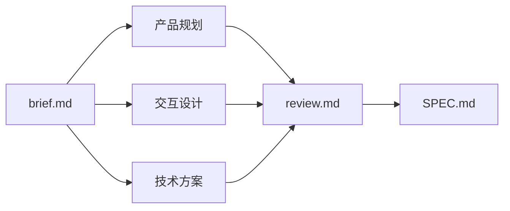

# 多智能体 Spec 写作工作流

## 适用范围

**使用本 skill**：需要多角色协作产出规格文档（产品规划 + 交互设计 + 技术方案），并通过独立评审提升质量。

**不要使用**：单一文档写作、纯代码实现、已有 SPEC 的小幅修订、不涉及多角色分工的需求。

## 速览

```
Planner(brief.md) → Generators(三稿并行) → Evaluator(review.md) → 迭代 → SPEC.md → Jobs 审查
```



编排顺序：Planner → Generators（并行）→ Evaluator →（P0 迭代）→ Claude 裁定 → Jobs 审查。

## 核心原则

| 原则 | 含义 |
|------|------|
| **上下文隔离** | 每个 Generator **只读** `brief.md`，不读彼此成稿，分歧才有价值 |
| **生成与检查分离** | 至少独立 Generator + 独立 Evaluator；同一路径不得既写稿又当唯一裁判 |
| **结构化交接** | 角色切换靠**文件**（Handoff、`review.md`），不靠口头堆在上下文里 |
| **栈无关** | 工作流与语言无关；默认示例针对 arc-kit（Rust CLI + TUI），其它栈写在 brief 的项目画像里 |

## 约束

- **acpx 语法与选项**（`exec`、权限、输出格式等）：见 **acpx skill**；本文不复制。
- acpx 全局选项（`--approve-all`、`--format` 等）必须在 **agent 名之前**。
- 多轮规格工作流用 **`exec`**（一次性），不必先 `sessions new`。
- 三稿未齐**不进** Evaluator；一路失败**只重跑该路**。
- P0 未清零**不写** SPEC。
- 与 Step 5 分工：Step 1–4 管过程中的稿与评；Step 5 管 SPEC 定稿后的产品自洽，不互替。

---

## 前置：环境与选角

```bash
arc status                    # 本机有哪些 agent（id、版本、技能数）
arc status --format json      # 脚本友好

## arc 安装
brew tap duoyuli/arc-kit https://github.com/duoyuli/arc-kit.git
brew install arc-kit
```

将 `arc status` 输出的 **`id`** 代入 `acpx <id> exec`（多数 id 与 acpx 友好名同名，如 `codex`、`claude`、`gemini`、`cursor`、`opencode`）。

**按可用 agent 数量选策略**：

| 可用数 | 做法 |
|--------|------|
| 1（如仅 codex） | 宿主（Claude）写产品+交互，codex 写技术；宿主任 Evaluator |
| 2 | 一人产品+交互，一人技术；宿主任 Evaluator |
| ≥ 3 | 三稿尽量三个不同 agent；第四个做 Evaluator（强烈建议与生成者不同） |

**异常处理**：
- `arc status` 无可用 agent → 宿主（Claude）独立完成全部角色，但仍须按 Step 1–5 流程走，Evaluator 阶段切换为批判者人设。
- `acpx` 未安装 → 提示用户 `npm i -g acpx`。

---

## Step 1：Planner — 写有野心的 brief

Claude 任 Planner，把用户意图写成 **`planning/<feature>/brief.md`**。

**职责**：不止记需求，而是把野心标准写高，让 Generator 有明确靶子。

章节顺序：**项目画像** → **当前系统** → **问题（只写痛点，不写方案）** → **野心标准** → **各 Generator 交付物路径**。

**brief 骨架**（可复制）：

```markdown
# <功能名称>

## 项目画像
- PRIMARY_LANGUAGE: ...        # 主实现语言
- CODE_EXAMPLE_RULE: ...       # compilable / type-checked / pseudocode-ok
- SURFACE: ...                 # CLI / TUI / Web / API
- EXAMPLE_FORMAT: ...          # 终端实录 / HTTP / 其它

## 本次选角
- 产品规划: <agent id>
- 交互设计: <agent id>
- 技术方案: <agent id>
- 评审: <agent id>

## 当前系统
...

## 问题（只写痛点，不写方案）
...

## 野心标准
...

## Generator 交付物
- product-plan.md: 范围、用户画像、验收标准、发布计划、风险
- interaction-design.md: 命令签名、用户旅程、终端示例、错误标准、边界情况
- tech-plan.md: 数据结构、算法、集成点、测试计划、实现顺序
```

未写项目画像时按 **arc-kit 默认**：Rust、可编译片段、CLI+TUI、真实终端输出。

brief 须完整到 Generator **不必再追问**。

---

## Step 2：Generators — 并行独立产出

三路可并行，将 `<agent-N>` 换成本机 `id`：

```bash
# Generator 1 — 产品规划
acpx --approve-all --format quiet --timeout 300 <agent-1> exec \
  'Read planning/<feature>/brief.md. Write product plan to planning/<feature>/product-plan.md.
   Include: user personas and pain points, detailed use cases, scope (in/out),
   acceptance criteria, release plan, success metrics, risks.
   End with a ## Handoff section: key decisions, assumptions, open questions, conflicts with brief.'

# Generator 2 — 交互设计
acpx --approve-all --format quiet --timeout 300 <agent-2> exec \
  'Read planning/<feature>/brief.md. Write interaction design to planning/<feature>/interaction-design.md.
   Include: all command signatures, complete user journeys with real terminal output examples,
   TUI flows, error message standards, edge cases.
   End with a ## Handoff section: key decisions, assumptions, open questions, conflicts with brief.'

# Generator 3 — 技术方案
acpx --approve-all --format quiet --timeout 300 <agent-3> exec \
  'Read planning/<feature>/brief.md and the codebase. Write tech plan to planning/<feature>/tech-plan.md.
   Include: data structures (actual code in PRIMARY_LANGUAGE per brief; arc-kit default: Rust),
   algorithms, integration points (which files change), test plan (specific test function names),
   implementation order.
   End with a ## Handoff section: key decisions, assumptions, open questions, conflicts with brief.'
```

### Handoff 模板（附于每份生成稿末尾）

```markdown
## Handoff
- 关键决策: ...
- 假设前提: ...
- 待解问题: ...
- 与 brief 的矛盾: ...
```

### 失败恢复

- 某路超时或报错 → **只重跑该路**，不影响其它已完成的稿。
- 重跑时带相同 brief，不带其它稿（保持上下文隔离）。
- 三稿未齐不进 Evaluator。

---

## Step 3：Evaluator — 按显式标准评分

三稿齐后执行。Evaluator **优先**与生成者不同 agent；不得已时宿主当 Evaluator，但须以批判者人设专门挑刺。

```bash
acpx --approve-all --format quiet --timeout 300 <evaluator-agent> exec \
  'Read planning/<feature>/brief.md, planning/<feature>/product-plan.md,
   planning/<feature>/interaction-design.md, planning/<feature>/tech-plan.md.
   You are a critic evaluator. Score each document and write planning/<feature>/review.md:

   product-plan.md:
   - Completeness: are user personas specific? use cases concrete?
   - Scope clarity: is in/out-of-scope unambiguous?
   - Acceptance criteria: testable, not vague?

   interaction-design.md:
   - Command signatures: conflict with product-plan?
   - Terminal output examples: real outputs, not abstract descriptions?
   - Edge cases: error paths specified?

   tech-plan.md (use PRIMARY_LANGUAGE/CODE_EXAMPLE_RULE from brief; arc-kit default: Rust):
   - Data structures: types complete per CODE_EXAMPLE_RULE?
   - Integration points: file change lists specific?
   - Implementation order: actionable (someone can start tomorrow)?

   Cross-document checks:
   - Naming consistency across all three docs
   - Behavior consistency between interaction and tech docs
   - Scope: tech covers what product promises

   Rate each criterion: PASS / NEEDS-WORK / FAIL.
   End with MUST-FIX list ranked P0/P1/P2. For each: target file, ## section heading,
   one-line excerpt of the problematic text.'
```

---

## Step 4：迭代与合并

读 `brief.md`、三稿、`review.md`。

### 有 P0 → 打回修复

按文件打回，只修受影响段落：

```bash
acpx --approve-all --format quiet --timeout 300 <agent> exec \
  'Read planning/<feature>/brief.md and planning/<feature>/<doc>.md.
   Fix the following P0 issues and overwrite the file:
   1. Under "## Section name" — excerpt: "..." — [what to change]
   2. ...
   Do not rewrite unaffected sections. Append an updated ## Handoff section.'
```

修复后**重跑 Step 3**（或至少让 Evaluator 确认 P0 清零），再合并。

**终止条件**：P0 清零，或迭代 **3 轮**后由 Claude 裁定剩余 P0 是否降级为 P1。

### P0 清零 → 合并 SPEC

合并为 **`planning/<feature>/SPEC.md`**：

- 命名/行为冲突：**选一个**，不保留「两种都行」。
- P1/P2：写入 SPEC「后续版本」或附录，不混入 v1 实现主线。
- 过度设计：移出 v1，标为后续。
- 代码与示例按 `CODE_EXAMPLE_RULE` / `EXAMPLE_FORMAT`。
- 实现顺序第一项应**明天就能开工**。

---

## Step 5：Jobs 视角审查

SPEC 合并后做**产品自洽**检查。这是最终质量门，不可跳过。

### 检查清单

| 维度 | 审查要点 | 典型问题 |
|------|---------|---------|
| **承诺 vs 步骤** | 核心承诺是否在 ≤ 2 步内兑现？ | 用户要 3+ 步才能完成声称"简单"的操作 |
| **检测 vs 解决** | 发现问题后是当场修复，还是甩给用户？ | 检测到错误但只打印"请运行 X 修复"，而不自动修 |
| **实现泄露** | 用户面文案是否泄露内部实现？ | 错误信息暴露内部路径、struct 名、provider 细节 |
| **道歉式提示** | 是否存在"抱歉，不支持"式表述？ | 应直接说能做什么，不解释不能做什么 |
| **入口过多** | 同一功能是否有多个入口让用户困惑？ | 3 种方式做同一件事，没说推荐哪个 |
| **默认值** | 最常见用例是否零配置即走？ | 要求用户填一堆参数才能完成最普通的操作 |
| **错误路径** | 出错后用户知道下一步做什么吗？ | 报错后无指引，用户卡住 |

### 审查方式

逐条对照 SPEC，发现问题标注原文位置并给出修改建议。修改直接写入 SPEC，不另开文件。

---

## 输出目录

```
planning/<feature>/
├── brief.md
├── product-plan.md
├── interaction-design.md
├── tech-plan.md
├── review.md
└── SPEC.md
```

---

## 本仓库 canonical 路径

唯一维护副本：**`built-in/skills/spec-generator-by-multi-agent/SKILL.md`**。
